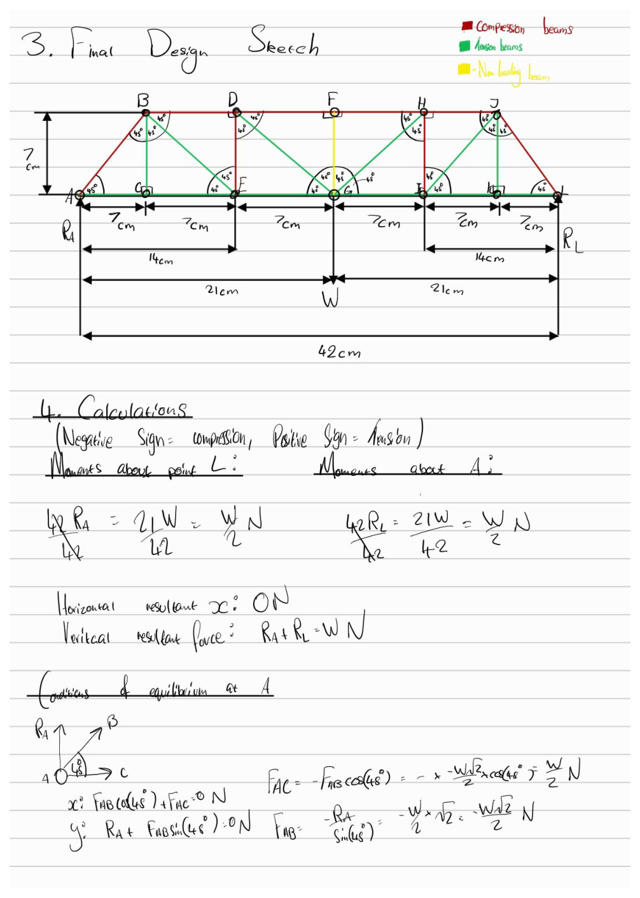
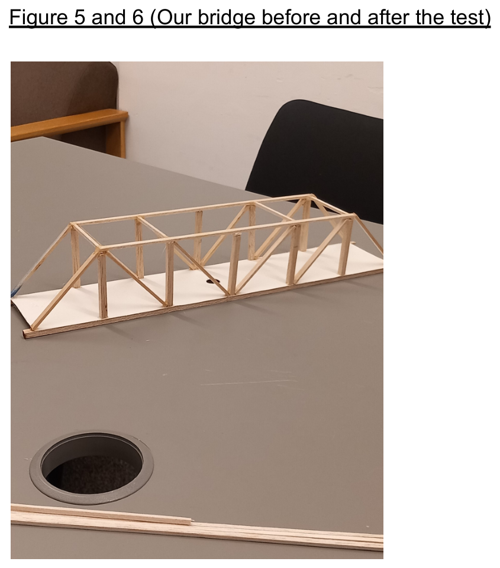
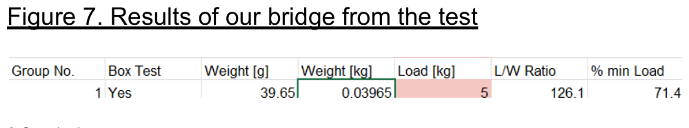
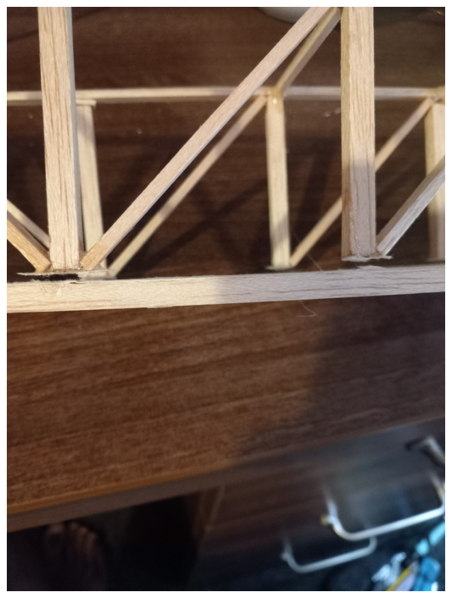

# Balsa Wood Truss Bridge — Engineering Mechanics Project

**Module:** Engineering Mechanics (Mechanical Engineering, University of Sussex)
**Team:** 3-person team project (Engineering Mechanics group coursework)
**Deliverable:** A physical balsa-wood bridge, statically analysed by hand and load-tested to failure

This repo documents a team project where we designed, hand-calculated, built, and physically tested a scale truss bridge against a fixed engineering brief — then had to account for why it failed below spec.

---

## TL;DR

| | |
|---|---|
| **Truss type** | Pratt truss, 42 cm span, 7 cm height |
| **Material** | Balsa wood (6×6, 6×3, 3×3 mm strip), glued joints, cord-reinforced |
| **Bridge mass** | 39.65 g |
| **Design target** | Carry 60 N (≈ 6.1 kg) minimum load |
| **Actual failure load** | 5 kg (≈ 49 N) — **below the 60 N target** |
| **Load/mass ratio achieved** | 126.1 (71.4% of the minimum load requirement) |
| **Failure mode** | Lower-chord joint failure near mid-span, members themselves stayed intact |

The bridge under-performed against the 60 N target. The most useful part of this project, in hindsight, wasn't the prediction — it was figuring out *why* the prediction and the test didn't match, which is what the [analysis](#what-actually-happened-vs-the-prediction) section below covers.

---

## The brief

We were given a fixed engineering specification (full brief in [`docs/project-brief.md`](docs/project-brief.md)), the key constraints being:

- Span a **400 mm gap** between two fixed supports
- Clear a **250 mm × 350 mm** shipping channel underneath (no part of the structure allowed to intrude on this zone, even under load)
- Carry a continuous roadway ≥ 60 mm wide, fitting a 60×70 mm "lorry," with no steps
- Provide a 50×50 mm clear access point and a 15 mm-diameter loading hole at the bridge centre
- Survive a minimum load test of **60 N**
- Built only from a fixed kit: balsa strip (6×6, 6×3, 3×3 mm), one sheet of "energy board" for the deck, ~4.3 m of cord, and glue

**Scoring** was based on **load ÷ mass** (a performance factor) relative to the rest of the cohort, with deductions for unmet brief criteria, and a report-quality adjustment. Critically: *if the bridge fails below 60 N, the report can save the grade — but it's capped at 49%.*

---

## Our approach

### 1. Concept design
We sketched and reasoned through three truss topologies before settling on a final design:

- A **Pratt truss with an added roof structure** — rejected because the extra members increased mass without enough load benefit, hurting the load/mass ratio we were being scored on.
- A **Howe truss** — rejected because its long diagonal *and* upper chord members end up in compression while only the short verticals are in tension. Compression members buckle; tension members don't. A truss where the long members are in compression is working against itself.
- A **Pratt truss without the roof** — chosen. By orienting the diagonals so the long diagonal members are in tension and only the short verticals carry compression, more of the structure's load path falls on the failure mode (tension) that doesn't depend on buckling resistance — which matters a lot for thin balsa strip.

See [`docs/concept-design.md`](docs/concept-design.md) for the sketches and the full reasoning we wrote down for ruling out the first two designs.

### 2. Final design
A symmetric Pratt truss, 42 cm span (slightly over the 40 cm/400 mm minimum to give clearance margin at the supports), 7 cm height (the minimum allowed), 6 equal panels of 7 cm each.



### 3. Hand calculations
We solved the truss twice, as a cross-check:

- **Method of joints**, working joint-by-joint from each support inward, assuming every member is in tension and reading off the sign at the end (positive = tension, negative = compression).
- **Method of sections**, cutting through the most central panel to directly check the chord forces without solving every joint.

Both methods agreed. Using symmetry, we only had to solve one half of the truss explicitly and mirrored the results for the other half.

Full working: [`calculations/method-of-joints.md`](calculations/method-of-joints.md) and [`calculations/method-of-sections.md`](calculations/method-of-sections.md). Final force table: [`calculations/force-table.md`](calculations/force-table.md).

**Headline result:** at the 60 N design load, the most heavily loaded members (the lower-chord/diagonal members nearest the load point, e.g. `F-D` and `F-H`) were predicted to carry **−90 N** (i.e. 90 N compression) — 1.5× the applied load, due to the geometry of the truss concentrating force into a few short members.

### 4. Build and test



The built bridge weighed **39.65 g**. It was loaded until failure on a test rig (per the module's standard load-test procedure) and failed at **5 kg (≈49 N)** — short of the 60 N target.



**Performance factor achieved:** load/mass = 5 kg / 0.03965 kg ≈ **126.1**, equal to **71.4%** of the minimum-load requirement.



The failure was localised to the **lower inner joints** near mid-span — the members themselves were not broken. This points to a joint (glue bond) failure rather than a member (material) failure.

---

## What actually happened vs. the prediction

Worth being upfront about: our own report contains two numbers for the bridge's predicted vs. actual performance, and they don't fully agree with each other on paper — this is normal for a first-pass hand-calc project and worth understanding rather than hiding:

- The hand calculation, assuming a 60 N design load and using a *different* mass figure noted on that page (0.08965 kg — likely a transcription slip from the measured 0.03965 kg), produced a **predicted** load/mass ratio of 181.3.
- The **measured** result, using the actual measured mass (0.03965 kg) and the actual failure load (5 kg), was a load/mass ratio of **126.1**.

The honest takeaway isn't "the bridge hit its number" — it's that **the analytical model was only ever a guide for member sizing, and the real bottleneck turned out to be joint strength, which the method of joints/sections doesn't model at all** (recall the simplifying assumption from the course: members are pin-jointed, and forces only act at joints — real balsa-and-glue joints aren't pins, and that gap is exactly where this bridge failed).

### If we did it again
From the report's conclusion:
- **Reinforce joints directly** — e.g. double-gluing or fillet a small amount of extra glue at each joint, since the joints failed before the members did.
- **Add gusset plates** cut from the spare energy board at each joint, to spread load over a larger glued area and stop the joint acting as a stress concentration.
- These changes target *mass-efficient* strength gains — i.e. ways to fix the actual failure mode without just adding more balsa (which would directly hurt the load/mass score).

---

## Repository structure

```
.
├── README.md                          ← you are here
├── docs/
│   ├── project-brief.md               ← summary of the assignment specification
│   └── concept-design.md              ← design options considered and why we rejected two of them
├── calculations/
│   ├── method-of-joints.md            ← full joint-by-joint hand solution
│   ├── method-of-sections.md          ← cross-check via method of sections
│   └── force-table.md                 ← final tabulated force in every member, tension/compression
├── images/                            ← scanned calculation pages, design sketches, and test photos
└── report/
    └── full-report.pdf                ← original submitted report (all 10 pages — includes teammates' names as submitted)
```

---

## Background: why trusses, and why this matters for design

A truss is a structure built entirely from two-force members — bars pinned at their ends, loaded only at the joints — which means every member is in pure tension or pure compression with no bending. That's the whole reason trusses are mass-efficient: a thin bar resists tension or compression along its axis far better than it resists bending, so triangulating a structure into two-force members lets you carry a given load with much less material than a solid beam would need.

This project applies that idea at a small, physically testable scale — and like most first attempts at translating a textbook idealisation onto a physical model, it surfaced the gap between the idealised pin-jointed model and a real glued joint. That gap, and not the truss geometry itself, is what ultimately set the load this particular bridge could carry.

---

## Skills demonstrated

- Static analysis of indeterminate structures by hand (method of joints, method of sections)
- Design-for-constraints under a fixed bill of materials and a competing-objectives scoring system (load/mass)
- Physical prototyping and destructive testing
- Root-cause analysis of a structural failure, distinguishing member failure from joint failure
- Technical reporting, including transparent reporting of a result that missed its target
