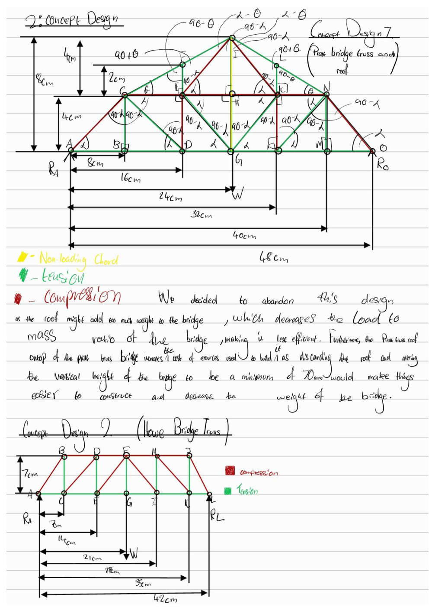
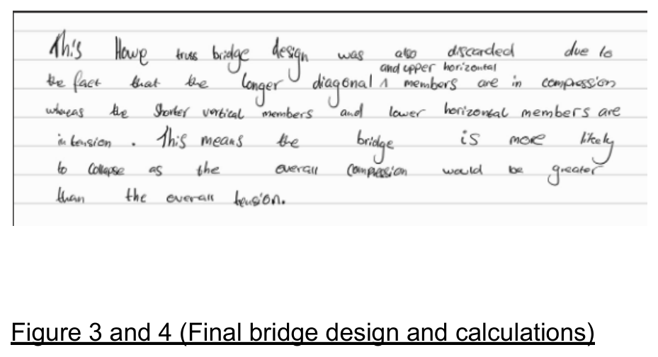

# Concept Design

Three truss layouts were sketched, force-classified (tension/compression by inspection, then checked numerically), and weighed against the brief's scoring criterion — load divided by mass — before settling on a final design.

## Option 1 — Pratt bridge truss with an added roof structure

A Pratt-truss deck with a full triangulated roof on top, connected by vertical members.

**Why we rejected it:** the roof adds a significant number of extra members and joints without a proportionate increase in load capacity for *this* load case (a single point load at mid-span on the deck). Since scoring is purely load/mass, any member that doesn't meaningfully contribute to carrying the design load is a direct mass penalty. The roof also increases material/build cost and complexity for no clearance benefit, since the brief's clearance constraint only concerns the channel *underneath* the deck.

## Option 2 — Howe bridge truss

A classic Howe truss: diagonals running from top chord down to bottom chord in the opposite sense to a Pratt truss.

**Why we rejected it:** in a Howe truss under this loading, the **longer diagonal members and the upper chord end up in compression**, while only the **shorter vertical members and the lower chord are in tension**. Compression members are governed by buckling, and buckling resistance drops off sharply as a member gets longer relative to its cross-section. Putting the *longest* members in the truss into compression is therefore the worst combination for a thin balsa structure — overall compression capacity becomes the limiting factor before tension capacity does, making the structure more likely to fail by buckling than its mass would suggest.

## Option 3 — Pratt bridge truss (no roof) — final choice

The same panel layout as Option 1, with the roof removed, and the diagonals oriented so that the **longer diagonal members are in tension** and only the **shorter vertical members carry compression**.

**Why we chose it:** this is the mirror image of the Howe problem — the long members do the job they're naturally good at (tension doesn't care about member length the way buckling does), and only the short, stiff verticals are asked to resist compression, where their short length keeps them well clear of buckling. For a fixed strip cross-section (the kit only gives a few fixed sizes), this is the more material-efficient way to triangulate the same span and height, which directly helps the load/mass scoring metric.

This reasoning is exactly the same logic shown in the course material comparing Howe and Pratt bridge trusses — Howe puts diagonals in compression and is flagged as "not very cost-effective," while Pratt puts diagonals in tension and is flagged as more cost-effective "as longer members are in tension."

## Final dimensions chosen

- Span: 42 cm (six 7 cm panels) — slightly over the 40 cm minimum, to allow clearance margin at the supports
- Height: 7 cm — the brief's minimum allowed truss height
- Diagonal angle: 45° (a consequence of equal panel width and truss height)
